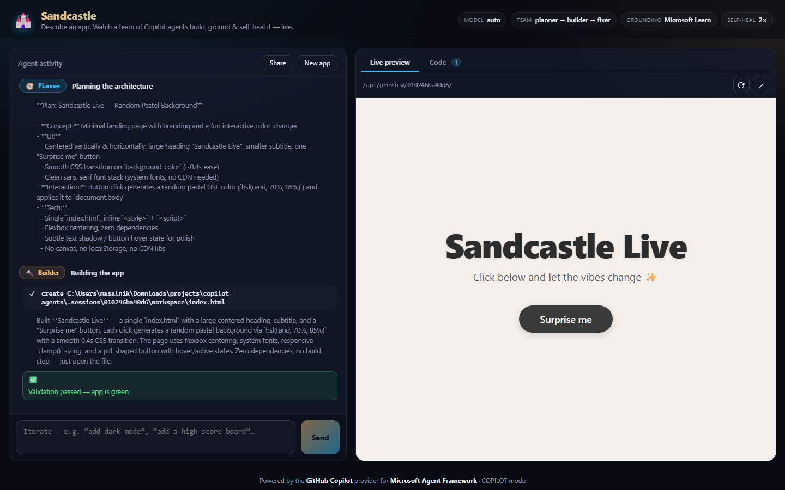
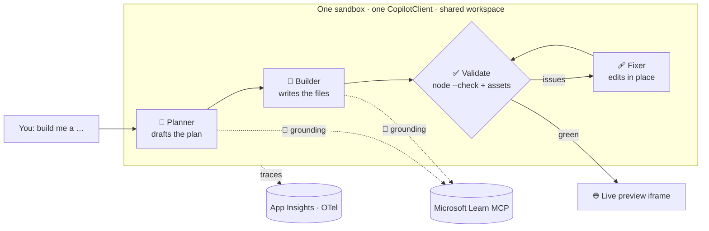
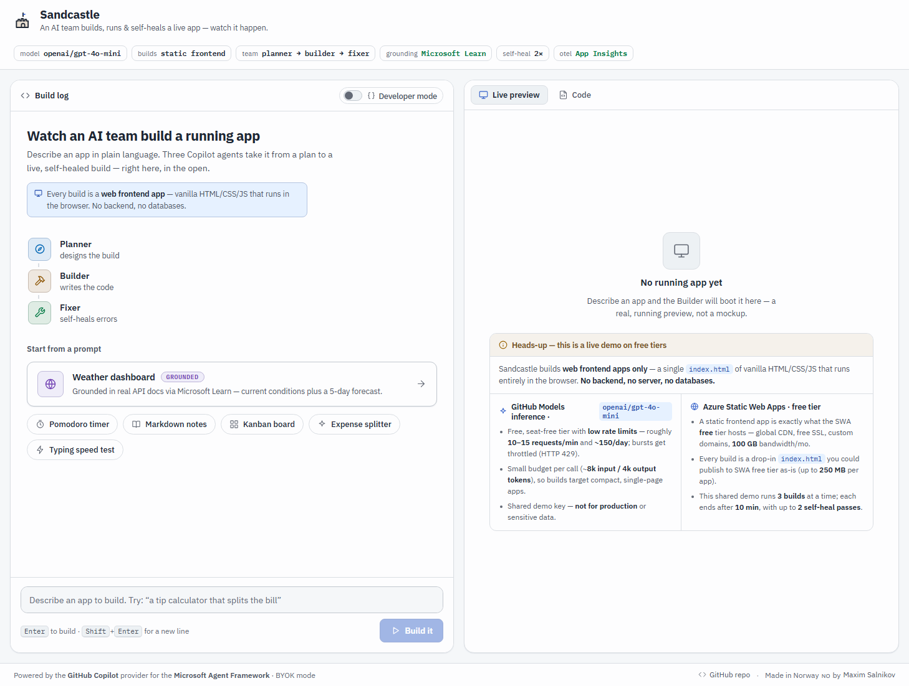

# 🏖️ Sandcastle

### Describe an app. Watch a team of GitHub Copilot agents build, run, and self‑heal it — live, in a sandbox.

**▶️ Live demo: https://mango-island-0bf66000f.7.azurestaticapps.net** &nbsp;·&nbsp; running on Azure free tiers (Static Web Apps + Container Apps).

> The public demo runs on a scale‑to‑zero backend — the **first request may take ~20–30s** to cold‑start the agent runtime, then it's fast.
> Model inference is **BYOK on the free [GitHub Models](https://github.com/marketplace/models) endpoint** — so the demo **never consumes a GitHub Copilot seat**. It's rate‑limited; heavy traffic may hit GitHub Models' free‑tier limits.

Sandcastle is a showcase for the new [**GitHub Copilot provider for Microsoft Agent Framework**](https://learn.microsoft.com/en-us/agent-framework/agents/providers/github-copilot?pivots=programming-language-python).
You type *“build me a …”*, and a multi‑agent team — **Planner → Builder → Fixer** — scaffolds a real app in an isolated sandbox, runs it, **self‑heals** its own build errors, grounds itself in live Microsoft Learn docs, and streams a **live preview** you keep iterating on by chat.

<p align="center">
  
</p>

<p align="center"><em>A real run: the Planner drafts a plan, the Builder writes the files, validation goes green, and the app renders in the live preview — all streamed as it happens.</em></p>

---

## Why this is different

A plain LLM call returns *text*. The Copilot provider gives each agent a **real, sandboxed computer** — and Sandcastle turns that into a spectator sport:

| Capability | In Sandcastle |
| --- | --- |
| 🖥️ **Shell execution** | Agents run, build, and test the app they write |
| 📁 **File read/write** | Agents scaffold the whole project; the UI shows a live file tree + source |
| 🌐 **URL fetching** | Pull assets/references from a URL you paste |
| 🔌 **MCP servers** | **Microsoft Learn MCP** grounds scaffolding in current docs |
| 🔴 **Streaming** | A live activity feed — every tool call, per agent, as it happens |
| 🧠 **Sessions / memory** | “Now add dark mode” edits the *same* app |
| 👥 **Multi‑agent** | Planner → Builder → Fixer, each streamed in its own lane |
| ♻️ **Self‑healing** | A real validator (`node --check` + asset checks) drives a Fixer loop until green |
| 📈 **Observability** | Built‑in OpenTelemetry → Azure Application Insights |

**Why it goes viral:** the “wow” is visible in seconds and instantly shareable — an AI *team* that doesn’t just write code but **runs and debugs it in front of you**, then hands you a live, remixable app.

## How it works



Each session gets its **own scratch workspace and `CopilotClient`**; the three personas share it and run sequentially so every tool/text delta streams live, tagged by agent. The Builder keeps an `AgentSession` for conversational iteration. Self‑healing is driven by a **real signal**, not vibes: inline/local JS is run through `node --check`, referenced assets must exist, and there must be a runnable `index.html`.

<p align="center">
  
</p>

## Quickstart — run it locally

**One command** (Docker):

```bash
docker compose up --build
# open http://localhost:5173
```

Provide Copilot auth via a local `.env` (`COPILOT_GITHUB_TOKEN=github_pat_…`, a fine‑grained PAT with the *Copilot Requests* permission) **or** log in once inside the container:
`docker compose exec backend copilot` → `/login`. See [`backend/.env.example`](backend/.env.example).

<details>
<summary><strong>Prefer a Dev Container or manual setup?</strong></summary>

**Dev Container:** open the repo in VS Code → *Reopen in Container* (`.devcontainer/`), then:

```bash
PYTHONPATH=. uvicorn backend.app.main:app --port 8099   # backend
npm --prefix frontend run dev                            # frontend (proxies /api)
```

**Manual:** Python 3.12 + Node 22 + the [`@github/copilot`](https://www.npmjs.com/package/@github/copilot) CLI logged in.

```bash
python -m venv backend/.venv
backend/.venv/bin/pip install -r backend/requirements.txt
PYTHONPATH=. backend/.venv/bin/uvicorn backend.app.main:app --port 8099
npm --prefix frontend ci && npm --prefix frontend run dev
```
</details>

## Deploy your own (Azure free tiers)

Sandcastle deploys to **Azure Static Web Apps (Free)** + **Azure Container Apps (free grant)** with **no paid container registry** — the backend image lives in public GitHub Container Registry.

```bash
az group create -n rg-sandcastle -l eastus2
az deployment group create -g rg-sandcastle -f infra/main.bicep \
  -p providerBaseUrl="https://<your-aoai>.openai.azure.com/openai/v1" providerApiKey="<key>"
```

Then wire up **deploy‑on‑push** with the included GitHub Actions workflow. Full walkthrough (secrets, OIDC, variables): **[`docs/deploy.md`](docs/deploy.md)**.

## Auth & compliance

GitHub Copilot is **licensed per user**, so a public multi‑user demo must **not** serve output from one person's Copilot seat. Sandcastle supports two modes:

- **Local‑first (your own seat)** — run it on your machine with your own Copilot login or `COPILOT_GITHUB_TOKEN` (fine‑grained PAT, *Copilot Requests*). Fully compliant — each developer uses their **own** seat, and you get Copilot's strongest models.
- **Hosted demo (BYOK)** — point the CLI at *your own* OpenAI‑compatible model provider so it **never touches a Copilot seat**. BYOK is activated by `COPILOT_PROVIDER_BASE_URL` and requires an explicit model (`GITHUB_COPILOT_MODEL`). GitHub auth is *not* required for model requests — the agentic runtime (shell/file/URL/MCP tools) still runs.
  - **This live demo** uses the **free [GitHub Models](https://github.com/marketplace/models) endpoint** (`https://models.github.ai/inference`, model `openai/gpt-4o-mini`) — free and seat‑free, but rate‑limited and best for lighter apps.
  - **For a robust public demo**, use **Azure OpenAI** (`COPILOT_PROVIDER_TYPE=azure`) or another paid provider — stronger models and higher limits (small pay‑as‑you‑go cost). See [`docs/deploy.md`](docs/deploy.md).

The hosted demo is also **rate‑limited, concurrency‑capped, timed‑out, and runs non‑root** with ephemeral per‑session workdirs.

## Tech stack

**Backend** — FastAPI · `agent-framework-github-copilot` · SSE streaming · OpenTelemetry · Docker (Node 22 + `@github/copilot`).
**Frontend** — React 19 · Vite · TypeScript.
**Infra** — Azure Static Web Apps + Container Apps + Application Insights, all free‑tier, via Bicep + GitHub Actions.

## Repo structure

```
backend/     FastAPI app: api · sessions · agents (planner/builder/fixer) · validation · observability
frontend/    React + Vite SPA: activity feed · file tree · live preview · example gallery
infra/       main.bicep — SWA + ACA + App Insights (free tiers)
.github/     deploy-on-push + CI workflows
docs/        architecture · deploy guide · launch kit · media
docker-compose.yml · .devcontainer/   one-command / zero-setup local run
```

## Documentation

- 📖 **[Technical deep‑dive article](articles/building-sandcastle-github-copilot-agent-framework.md)** — how the GitHub Copilot provider works and how Sandcastle was built (with diagrams).
- [Architecture](docs/architecture.md) — verified provider API, streaming schema, orchestration, hardening.
- [Deploy guide](docs/deploy.md) — provisioning, CI/CD, OIDC, local run.
- [Launch kit](docs/launch.md) — demo script + social copy.

## Acknowledgements

Built on [Microsoft Agent Framework](https://learn.microsoft.com/agent-framework/) and the [GitHub Copilot CLI](https://github.com/github/copilot-cli). Not an official Microsoft or GitHub product.

## License

MIT — see [`LICENSE`](LICENSE).
