# Giving AI agents a real computer

### How we built **Sandcastle** on the new GitHub Copilot provider for Microsoft Agent Framework — and what the feature actually unlocks

> **▶️ Live demo:** https://mango-island-0bf66000f.7.azurestaticapps.net &nbsp;·&nbsp; **Source:** https://github.com/webmaxru/sandcastle
> Running on Azure free tiers (Static Web Apps + Container Apps). It builds **frontend‑only static web apps** — vanilla HTML/CSS/JS with no backend or database — the kind of app that drops straight onto SWA's free tier. Model inference is seat‑free BYOK on the free [GitHub Models](https://github.com/marketplace/models) endpoint.

<p align="center">
  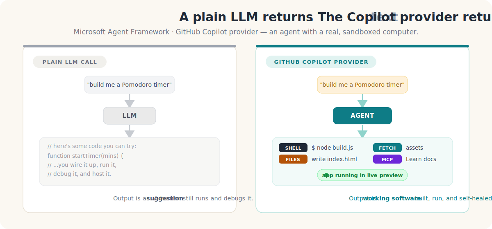
</p>

Most "AI app" demos boil down to the same thing: a prompt goes in, a wall of text comes out, and *you* still have to copy it, run it, fix the three things that don't compile, and host it. The [**GitHub Copilot provider for Microsoft Agent Framework**](https://learn.microsoft.com/en-us/agent-framework/agents/providers/github-copilot?pivots=programming-language-python) flips that: instead of returning *text about* code, an agent gets a **real, sandboxed computer** — it can run shell commands, read and write files, fetch URLs, and call MCP servers — and it uses that computer to actually build and run the thing you asked for.

Sandcastle is a showcase for exactly that. You type *"build me a Pomodoro timer with a dark theme"*, and a team of Copilot agents — **Planner → Builder → Fixer** — scaffolds a real app in an isolated sandbox, runs it, **self‑heals its own build errors**, grounds itself in live Microsoft Learn docs, and streams a **live preview** you keep iterating on by chat. Every shell command and file write shows up in a live activity feed, tagged by which agent did it.

This article is a technical deep‑dive on both halves: **what the provider gives you**, and **how Sandcastle is engineered** to turn it into a spectator sport — including the auth model that lets a *public* demo run without ever spending a Copilot seat.

> **📐 Scope, on purpose.** Sandcastle only ever builds **static web _frontend_ apps** — a single `index.html` of vanilla HTML/CSS/JS that runs entirely in the browser, with **no backend, no server processes, and no databases.** That constraint is baked into the agent personas, and it's a feature rather than a shortcut: a static frontend is exactly the workload [**Azure Static Web Apps**' free tier](https://learn.microsoft.com/en-us/azure/static-web-apps/plans) is built for (global CDN, free SSL, custom domains, 100 GB bandwidth/month, 250 MB per app). Anything the demo builds, you can publish for free, as‑is. The demo is upfront about this — and about its inference limits — right on the home screen:

<p align="center">
  
</p>

---

## Part 1 — The feature: an agent that *does*, not just *says*

### The 30‑second version

Microsoft Agent Framework can now use the [GitHub Copilot SDK/CLI](https://github.com/github/copilot-sdk) as an agent backend. In Python that's one package:

```bash
pip install agent-framework-github-copilot --pre
```

…and a handful of lines to a working agent:

```python
import asyncio
from agent_framework.github import GitHubCopilotAgent

async def main():
    agent = GitHubCopilotAgent(instructions="You are a helpful assistant.")
    async with agent:                       # starts/stops the Copilot runtime
        result = await agent.run("What is Microsoft Agent Framework?")
        print(result)

asyncio.run(main())
```

The `GitHubCopilotAgent` is a standard `AIAgent`, so everything else in Agent Framework — streaming, sessions, tools, tool approval, observability, workflows — works with it. What makes it *special* is the runtime underneath.

### What you actually get

A plain chat model can only emit tokens. The Copilot provider wraps a runtime that exposes **agentic capabilities**, gated by a permission handler you supply:

| Capability | What it means for you |
| --- | --- |
| 🖥️ **Shell execution** | The agent runs, builds, and tests the code it writes |
| 📁 **File read/write** | The agent scaffolds an entire project on disk |
| 🌐 **URL fetching** | The agent pulls references/assets from the web |
| 🔌 **MCP servers** | Local (stdio) or remote (HTTP) [Model Context Protocol](https://modelcontextprotocol.io) tools — e.g. **Microsoft Learn** for grounded docs |
| 🔴 **Streaming** | Token deltas *and* structured tool‑execution events, live |
| 🧠 **Sessions / memory** | Multi‑turn context so *"now add dark mode"* edits the same work |
| 🔐 **Permissions** | Shell/file/URL access is **off by default**; you approve per request |

That permission gate is the whole ballgame for safety. By default the agent can't touch your shell or filesystem — you opt in via a handler. For a trusted sandbox you can approve everything; for anything sensitive you prompt a human. The docs are explicit: **run agents that have shell/file permissions inside a container or Dev Container.** Sandcastle takes that seriously (Part 3).

### Configuration knobs

The Python agent reads a small set of environment variables:

| Variable | Purpose |
| --- | --- |
| `GITHUB_COPILOT_MODEL` | Model to use (e.g. `gpt-5`, `claude-sonnet-4`) |
| `GITHUB_COPILOT_TIMEOUT` | Request timeout (seconds) |
| `GITHUB_COPILOT_CLI_PATH` | Path to the Copilot CLI executable |
| `GITHUB_COPILOT_BASE_DIRECTORY` | CLI session/config dir (defaults to `~/.copilot`) |
| `GITHUB_COPILOT_LOG_LEVEL` | CLI log level |

And per‑agent you can pass `default_options` with `model`, `mcp_servers`, `on_permission_request`, a custom `provider` (the BYOK escape hatch — Part 4), and more.

---

## Part 2 — The idea: make agentic coding a spectator sport

A single agent that writes a file is neat. It becomes *viral‑demo* material when you:

1. **Show the work.** Stream every tool call and text delta so people watch the app get built.
2. **Make it a team.** Split the job into a Planner, a Builder, and a Fixer, each in its own visible lane.
3. **Close the loop.** Validate the output with a *real* signal and let the Fixer repair it until it's green — no human in the loop.
4. **Hand back something live.** Render the result in an iframe the user keeps iterating on by chat.

That's Sandcastle. Here's a real run — Planner and Builder streaming on the left, the validation banner going green, and the generated app rendering in the live preview on the right:

<p align="center">
  
</p>

### System architecture

Two deployables, both on Azure free tiers: a React/Vite SPA on **Static Web Apps**, and a FastAPI backend on **Container Apps** whose image bundles Node 22 + `@github/copilot`.

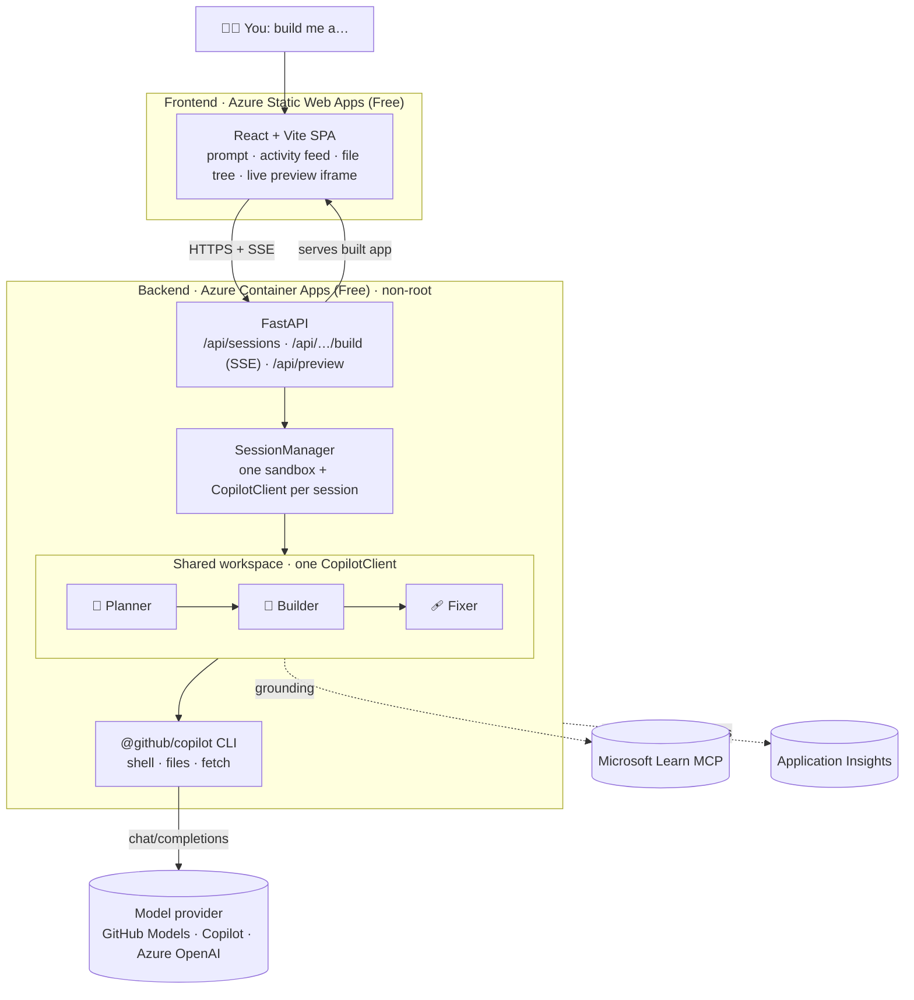

The core design decision: **each session owns one scratch workspace and one `CopilotClient`; the three personas share it and run sequentially.** Sharing one client means the Planner's plan, the Builder's files, and the Fixer's repairs all operate on the same directory — and running sequentially means every tool/text delta can be streamed live, tagged by agent, with no interleaving confusion.

---

## Part 3 — How it was built

### One sandbox, one client, three personas

The `SessionManager` creates a per‑session working directory, binds a `CopilotClient` to it, and stands up three `GitHubCopilotAgent` personas that share that client. They're kept alive across requests with an `AsyncExitStack`, and the Builder gets an `AgentSession` so *"now add a leaderboard"* edits the same app instead of starting over:

```python
# backend/app/sessions.py  (abridged)
client = self._make_client(workdir)          # one CopilotClient, bound to the sandbox
opts   = self._default_options()             # permissions + model + MCP + (BYOK) provider
stack  = contextlib.AsyncExitStack()

planner = await stack.enter_async_context(
    GitHubCopilotAgent(instructions=personas.PLANNER_INSTRUCTIONS, client=client, default_options=opts))
builder = await stack.enter_async_context(
    GitHubCopilotAgent(instructions=personas.BUILDER_INSTRUCTIONS, client=client, default_options=opts))
fixer   = await stack.enter_async_context(
    GitHubCopilotAgent(instructions=personas.FIXER_INSTRUCTIONS,  client=client, default_options=opts))

builder_session = builder.create_session(session_id=sid)   # conversational memory
```

The `default_options` are where permissions and grounding get wired in — `PermissionHandler.approve_all` for the trusted sandbox, plus the Microsoft Learn HTTP MCP server for every agent:

```python
opts = {
    "on_permission_request": PermissionHandler.approve_all,
    "timeout": float(settings.copilot_timeout),
    "mcp_servers": {
        "microsoft-learn": {"type": "http", "url": "https://learn.microsoft.com/api/mcp", "tools": ["*"]},
    },
}
```

### Why a *manual* orchestrator (not the Workflow engine)

Agent Framework ships a `WorkflowBuilder` for multi‑agent orchestration. Sandcastle deliberately uses a **hand‑written sequential loop** instead — because the entire point of the demo is that you *watch it happen*. A manual loop lets every underlying Copilot tool/text delta stream straight to the UI, tagged with the lane that produced it:

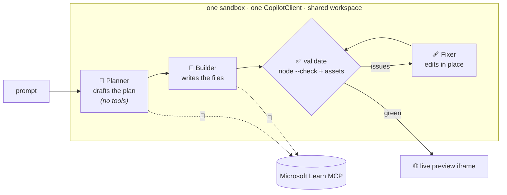

The three personas are just carefully written instruction prompts. The **Planner** emits a short plan and is told *not* to touch files. The **Builder** produces a complete, self‑contained `index.html` app and is told to edit in place when iterating. The **Fixer** receives a concrete list of validator problems and fixes exactly those without rewriting the app.

The loop that drives them is small enough to read in full:

```python
# backend/app/agents/orchestrator.py  (abridged)
async def run_team(session, prompt, max_fix_attempts):
    is_iteration = (session.workdir / "index.html").exists()

    # 1) Planner — advisory, streamed
    async for ev in _stream_agent(session.planner, planner_prompt(prompt, is_iteration), "planner"):
        yield ev

    # 2) Builder — writes/edits files, keeps conversational memory
    async for ev in _stream_agent(session.builder, builder_prompt(prompt, plan_text, is_iteration),
                                  "builder", session=session.builder_session):
        yield ev

    # 3) Fixer — self-healing loop against a *real* validator
    issues = await validate_workspace(session.workdir)
    yield {"type": "validation", "attempt": 0, "issues": issues, "green": not issues}
    attempt = 0
    while issues and attempt < max_fix_attempts:
        attempt += 1
        async for ev in _stream_agent(session.fixer, fixer_prompt(issues), "fixer"):
            yield ev
        issues = await validate_workspace(session.workdir)      # re-check
        yield {"type": "validation", "attempt": attempt, "issues": issues, "green": not issues}

    yield {"type": "done", "preview": f"/api/preview/{session.id}/" if ... else None, "green": not issues}
```

### Self‑healing on a *real* signal, not vibes

"Self‑healing" is only meaningful if the health check is real. Sandcastle's validator runs actual checks against the generated app and returns a list of concrete, human‑readable problems (an empty list means *green*):

- `index.html` must exist and be non‑trivial.
- Every inline and local `<script>` is run through **`node --check`** (real JS syntax validation).
- Every locally referenced `src`/`href` asset must exist on disk.

```python
# backend/app/validation.py  (the real signal)
proc = await asyncio.create_subprocess_exec(
    "node", "--check", tmp,
    stdout=asyncio.subprocess.PIPE, stderr=asyncio.subprocess.PIPE,
)
_, stderr = await proc.communicate()
if proc.returncode != 0:
    issues.append(f"Syntax error in an inline <script>: {detail}")
```

That output is fed verbatim to the Fixer, which edits in place; then the workspace is re‑validated. Repeat up to `SANDCASTLE_MAX_FIX_ATTEMPTS`.

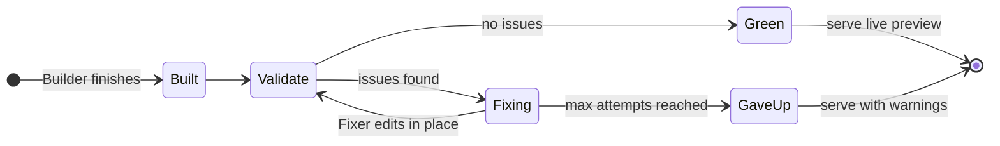

### Streaming everything: the SSE event model

The build endpoint is a **Server‑Sent Events** stream. Each `AgentResponseUpdate` from the Copilot runtime is mapped to a small, typed UI event — a tool starting, a tool finishing, a text delta, a usage record — and every event carries the `agent` lane so the UI can render three columns:

```python
# backend/app/agents/stream_map.py  (abridged)
if dname == "ToolExecutionStartData":
    return [{"type": "tool_start", "tool": tool, "summary": tool_summary(tool, args), ...}]
if dname == "ToolExecutionCompleteData":
    return [{"type": "tool_end", "success": data.success, "error": error_text(data.error)}]
if dname == "AssistantUsageData":
    return [{"type": "usage", "model": data.model,
             "input_tokens": data.input_tokens, "output_tokens": data.output_tokens,
             "cost": data.cost, "finish_reason": data.finish_reason,
             "duration_ms": int(data.duration.total_seconds() * 1000)}]
if text:
    return [{"type": "text", "text": text}]
```

Put together, one build turn looks like this over the wire:

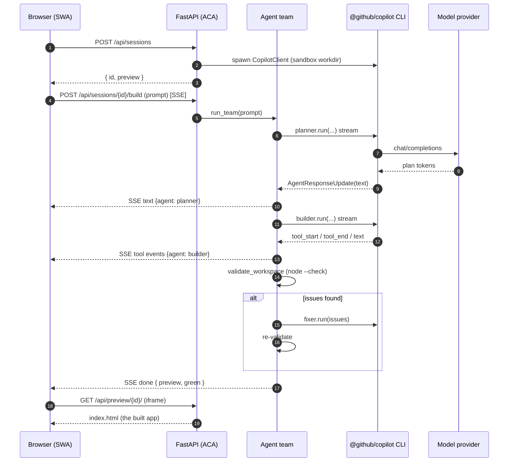

The frontend renders these as a live activity feed, a file tree with a source viewer, and the preview iframe:

<p align="center">
  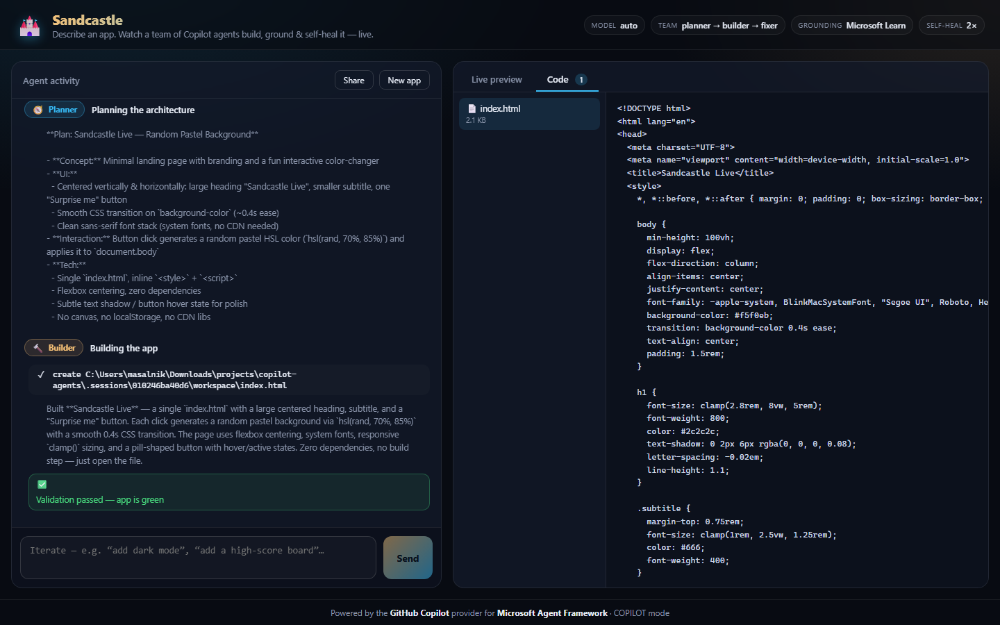
</p>

### Developer mode: every token, tool call, and timing

Because the whole build is already a typed event stream, exposing it in full is a toggle, not a rewrite. **Developer mode** (top of the Build log) stops coalescing and streams *every* event into the feed — each one stamped with the elapsed time, the emitting agent, and its raw payload: `status` and `phase` transitions, per‑tool `tool_start`/`tool_end` with arguments, text deltas, and a rich **usage** row per agent turn (model, input/output tokens, cost, duration, `finish_reason`). It turns the demo into a live, inspectable trace of what the Copilot runtime is actually doing.

<p align="center">
  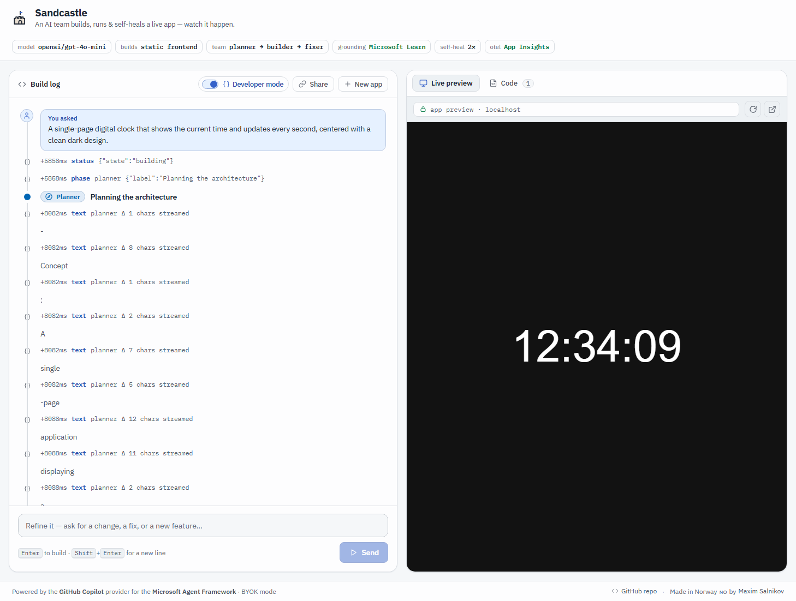
</p>

> One footgun worth calling out: a failed tool's `data.error` is a `ToolExecutionCompleteError` object, **not** a string — `json.dumps` chokes on it and kills the SSE stream mid‑build. The `error_text()` helper coerces it to a string (with a `default=str` guard on the dump) so a broken build streams its error cleanly instead of hanging.

### Grounding in Microsoft Learn via MCP

Because MCP is first‑class in the provider, wiring **live, authoritative docs** into every agent is a few lines (shown above). When a request touches Microsoft/Azure/.NET tech, the Planner and Builder can call `microsoft-learn-*` tools to consult current documentation instead of hallucinating an API. In one verified run, a "Dynamic Sessions cheat‑sheet" build made **8 Microsoft Learn lookups** and produced grounded, accurate content.

---

## Part 4 — The auth model everyone gets wrong (and the seat‑free trick)

Here's the question that decides whether your Copilot‑powered app can be a *public* demo: **whose credentials pay for inference?**

The GitHub Copilot provider is licensed per user. Point it at your own token and it's perfect for local dev — but a public URL that injects *your* token spends *your* seat on every visitor. The fix is to separate the two planes the provider actually has:

<p align="center">
  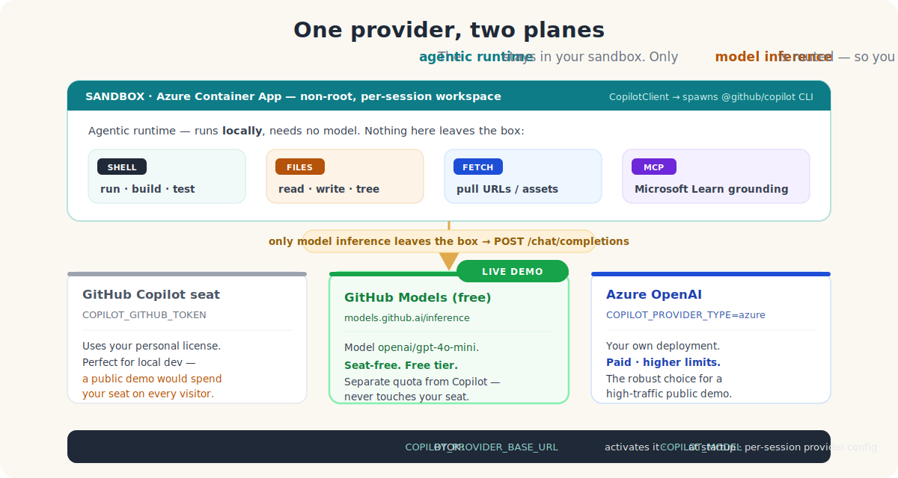
</p>

The **agentic runtime** (shell, files, URL fetch, MCP) always runs locally in your sandbox — it needs no model and spends no tokens. Only **model inference** is routed. So you can keep all the agentic superpowers and swap *just* the inference target to something seat‑free.

That's **BYOK** (bring‑your‑own‑key), activated when you set `COPILOT_PROVIDER_BASE_URL`. Sandcastle's live demo routes inference to the **free GitHub Models endpoint** (`https://models.github.ai/inference`, model `openai/gpt-4o-mini`) — a **separate quota from the Copilot seat**, so the public demo never touches one.

### The two‑layer BYOK contract (the part that bites everyone)

Getting env‑only BYOK working took discovering two non‑obvious requirements. Both are now handled in `sessions.py`:

**1) The CLI needs an explicit model *at startup*.** Setting `GITHUB_COPILOT_MODEL` (a per‑session framework setting) is *not* enough — the CLI process itself exits with *"BYOK providers require an explicit model"* unless `COPILOT_MODEL` is present in its environment. Also note: `CopilotClient(env=…)` **replaces** the process environment, so you must start from `os.environ` and layer the provider vars on top (or the CLI loses `PATH`/`COPILOT_HOME`):

```python
# backend/app/sessions.py  — _make_client (abridged)
byok_env = {k: v for k, v in os.environ.items()
            if k not in ("COPILOT_GITHUB_TOKEN", "GH_TOKEN", "GITHUB_TOKEN")}  # drop seat auth
byok_env["COPILOT_PROVIDER_BASE_URL"] = settings.provider_base_url
byok_env["COPILOT_PROVIDER_TYPE"]     = settings.provider_type          # "openai" | "azure" | ...
byok_env["COPILOT_PROVIDER_API_KEY"]  = settings.provider_api_key
byok_env["COPILOT_MODEL"]             = settings.byok_model             # ← required at startup
kwargs["env"] = byok_env
kwargs["use_logged_in_user"] = False
```

**2) Each *session* must be created with a `provider` config.** Process‑level env alone isn't enough for the session RPC — without it you get *"Session was not created with authentication info or custom provider."* So the per‑agent `default_options` also carries a provider block:

```python
# backend/app/sessions.py  — _default_options (abridged)
if settings.byok_enabled:
    opts["provider"] = {
        "type": settings.provider_type,          # "openai"
        "base_url": settings.provider_base_url,   # https://models.github.ai/inference
        "api_key": settings.provider_api_key,
        "model_id": settings.byok_model,          # openai/gpt-4o-mini
        "wire_model": settings.byok_model,
    }
```

Do both and BYOK "just works." For a high‑traffic public demo you'd point the same two settings at **Azure OpenAI** (`COPILOT_PROVIDER_TYPE=azure`, host URL only) for higher limits — one config change, zero code change.

> **TL;DR of the auth model:** the demo you're looking at runs its agents with full shell/file powers *and* spends **no Copilot seat**, because only inference is routed — to a free, separate‑quota endpoint.

---

## Part 5 — Hardening the sandbox

Running an agent with `approve_all` means containment is the security boundary. Sandcastle's hosted profile applies defense‑in‑depth:

- **Non‑root** container, **per‑session scratch dir**, workspace cleanup on session close.
- **Concurrency cap** and **session timeouts** (single replica keeps the in‑memory session map correct).
- A per‑client sliding‑window **rate limiter** (`X‑Forwarded‑For` aware) → **429 + `Retry‑After`** on session creation (per hour) and builds (per minute).
- **Output caps**: SSE frames truncate oversized fields with a total‑event cap; the file endpoint enforces a max byte size + `nosniff`; the preview server is **path‑traversal guarded**.

A stronger isolation upgrade is a drop‑in: **Azure Container Apps Dynamic Sessions** (Hyper‑V isolated) or the Copilot CLI's native `--sandbox`.

---

## Part 6 — Observability for free

Because `GitHubCopilotAgent` is a standard Agent Framework agent, **OpenTelemetry** works out of the box. Sandcastle calls `configure_otel_providers()` once at startup, so every agent invocation, tool call, and model request is traced with `gen_ai.*` attributes (including token usage). The exporter auto‑selects the first available of **Azure Application Insights** → **OTLP** → **console** → disabled — all defensive, sensitive telemetry off by default:

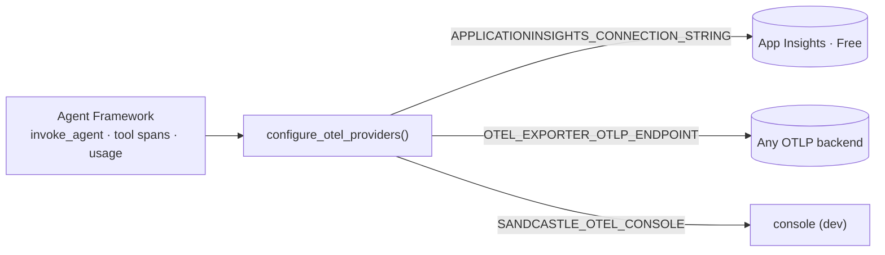

---

## Part 7 — Deploying on Azure free tiers

The whole thing runs on free grants: **Static Web Apps (Free)** for the SPA and **Container Apps (Free, scale‑to‑zero)** for the backend, provisioned by Bicep, shipped by GitHub Actions on push to `main` using **OIDC** (no long‑lived cloud secrets):

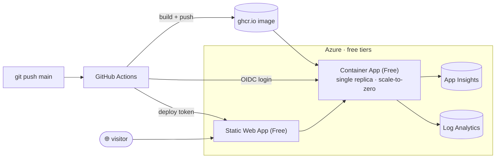

Scale‑to‑zero has one visible cost: the **first request after idle takes ~20–30s** to cold‑start the agent runtime, then it's fast. A single replica is a deliberate choice — it keeps the in‑memory session map and rate limiter correct without a shared store.

---

## The build journey

Sandcastle was built iteratively, phase by phase — each one verified end‑to‑end before moving on:

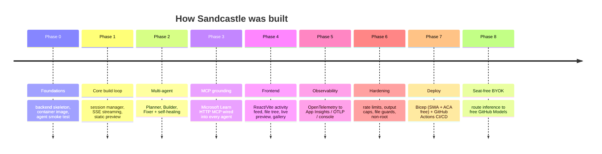

---

## Lessons worth stealing

- **The runtime is local; only inference is remote.** Internalizing that split is what unlocks a compliant public demo — full agentic powers, zero Copilot seats spent.
- **BYOK has a two‑layer contract:** `COPILOT_MODEL` at CLI startup **and** a per‑session `provider` config. Miss either and you get cryptic errors. `CopilotClient(env=…)` *replaces* the environment — build it from `os.environ`.
- **Stream the raw deltas.** A manual orchestrator beats a black‑box workflow engine when the demo *is* the visibility. Map `AgentResponseUpdate` → typed UI events and tag by agent.
- **Self‑healing needs a real oracle.** `node --check` + asset existence is a cheap, high‑signal validator that turns "self‑healing" from a buzzword into a loop that actually converges.
- **Permissions + containers are the safety story.** Default‑deny permissions plus a non‑root, rate‑limited, path‑guarded sandbox is the minimum bar for `approve_all`.

---

## Build your own

```bash
git clone https://github.com/webmaxru/sandcastle
cd sandcastle
docker compose up --build         # backend + frontend, one command
```

- **Live demo:** https://mango-island-0bf66000f.7.azurestaticapps.net
- **Source:** https://github.com/webmaxru/sandcastle
- **The feature:** [GitHub Copilot provider for Microsoft Agent Framework](https://learn.microsoft.com/en-us/agent-framework/agents/providers/github-copilot?pivots=programming-language-python)
- **GitHub Models (free inference):** https://github.com/marketplace/models

The most compelling thing about the Copilot provider isn't any single capability — it's that an agent stops being a text generator and becomes a *teammate with a computer*. Sandcastle just puts a window on that. Go describe an app and watch a team build it.

---

<sub>Built with the GitHub Copilot provider for Microsoft Agent Framework · deployed on Azure free tiers · diagrams in this article are Mermaid + hand‑authored SVG in <a href="media/"><code>./media</code></a>.</sub>
